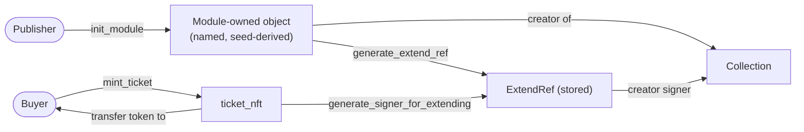
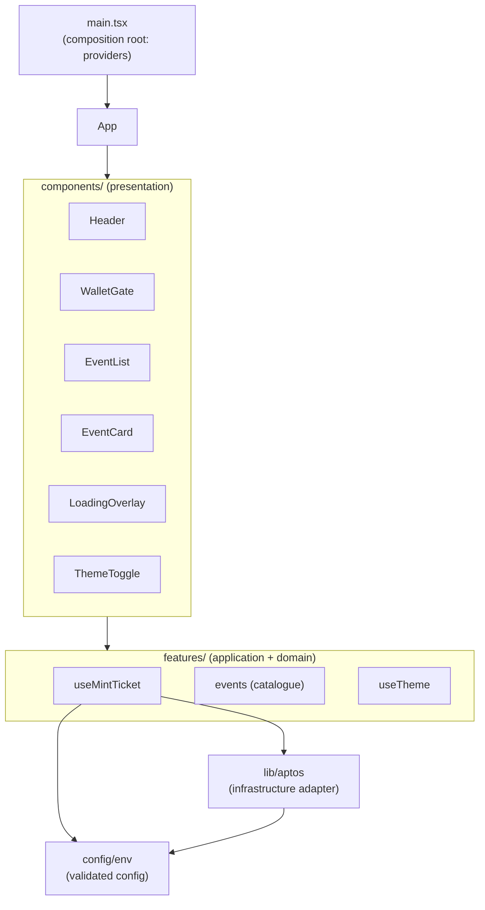
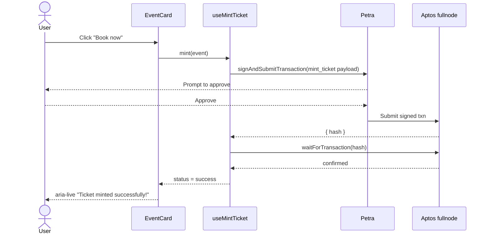

# Architecture

This document explains how TicketLedger is structured and the design patterns
it uses. The guiding principle is **right-sizing**: TicketLedger is a small
app (one Move module + one SPA), so we apply the _spirit_ of patterns like
hexagonal architecture and DDD at a scale that fits, rather than ceremonially.

## 1. The on-chain / off-chain boundary

TicketLedger has no backend. The system splits cleanly along a single seam:

- **On-chain (`contracts/`)** owns all state and the authoritative rules:
  what a ticket is, how it's minted, who owns it.
- **Off-chain (`web/`)** is a thin, stateless client that builds transactions,
  submits them through the user's wallet, and reads results back.

This is effectively a **ports-and-adapters** boundary where the blockchain is
the system of record and the SPA is one adapter onto it.

## 2. Smart contract design

Module: `ticketledger::ticket_nft` (`contracts/sources/ticket_nft.move`).

### Digital Asset standard

Tickets are **Aptos Digital Assets** (`aptos_token_objects`) — real,
transferable NFTs that live in a single shared collection (`TicketLedger
Events`). This replaces the original design, which stored a plain `move_to`
resource (not a token, not transferable, and capped at one per account).

### Object-capability pattern (the key decision)

In the Digital Asset standard, only the **collection creator** may mint tokens
into a collection. But we want _any_ wallet to self-mint — without the platform
co-signing every transaction. We resolve this with an **object + capability**:

- `init_module` (runs on publish) creates a deterministic, module-owned object
  and stores its `ExtendRef`.
- The object — not the publisher — is the collection creator.
- On each `mint_ticket`, the module re-derives the creator signer from the
  stored `ExtendRef`, mints the token, and transfers it to the buyer.

This is the on-chain equivalent of a **capability object**: the right to act as
the creator is held by the module, scoped to exactly that purpose.

### Invariants & safety

- Input validation rejects empty `name`/`uri` (`E_EMPTY_FIELD`).
- A guard asserts the collection exists (`E_NOT_INITIALIZED`) — defensive; it
  cannot normally fail because `init_module` runs at publish.
- Tokens are GUID-addressed, so an account may hold unlimited tickets.
- A `TicketMinted` event is emitted for off-chain indexing.
- `#[view]` functions expose read-only state without a transaction.

## 3. Web client design

The SPA is organized by **responsibility**, mirroring a lightweight hexagonal
split. Dependencies point inward/downward; presentation never talks to the SDK
directly.

| Layer          | Folder                       | Role                                                                                    |
| -------------- | ---------------------------- | --------------------------------------------------------------------------------------- |
| Composition    | `main.tsx`                   | Wires providers (wallet adapter) — the composition root.                                |
| Configuration  | `config/`                    | Runtime-validated env; single source of the module id/network.                          |
| Infrastructure | `lib/`                       | The shared Aptos client (adapter to the fullnode).                                      |
| Application    | `features/*/use*.ts`         | Use-case hooks (`useMintTicket`, `useTheme`) — all wallet/SDK orchestration lives here. |
| Domain data    | `features/tickets/events.ts` | The event catalogue (would be an indexer call in production).                           |
| Presentation   | `components/`                | Dumb, accessible components that render state and raise events.                         |

### Why this split

- **Testability:** pure logic (`config/env`, `events`) and presentation
  (`EventCard`, `ThemeToggle`) are tested without a blockchain.
- **Isolation of change:** swapping the data source (static → indexer) or the
  SDK touches `features/`/`lib/`, not the components.
- **No leakage:** components import `useMintTicket`, never `@aptos-labs/ts-sdk`.

### Mint flow (sequence)

## 4. Theming

A single set of CSS custom properties uses the native `light-dark()` function;
`color-scheme` selects the active side. `useTheme` writes `data-theme` on
`<html>` (persisted to `localStorage`, defaulting to the OS preference). No
duplicated token blocks, no flash of styled content from a heavy theme library.

## 5. Testing strategy

- **Contract:** Move unit tests cover mint+transfer, multi-mint, the
  uninitialized guard, and input validation.
- **Web:** Vitest + Testing Library cover config, catalogue integrity,
  component behavior, and theme persistence. The transaction-submitting path of
  `useMintTicket` is deliberately left to manual/E2E testing (it needs a wallet)
  — see [docs/DISASTER_RECOVERY.md](./docs/DISASTER_RECOVERY.md) for the manual
  verification checklist.

## 6. Deliberately _not_ here

Because this is a wallet-driven SPA + on-chain module, the following were
intentionally **not** added (they would be pure overhead): server-side API,
relational DB / ORM / migrations, Redis cache, GraphQL/BFF gateway, generated
REST SDKs, and a monorepo workspace tool. See the README and CHANGELOG for the
list of deferred, genuinely-applicable enhancements.
