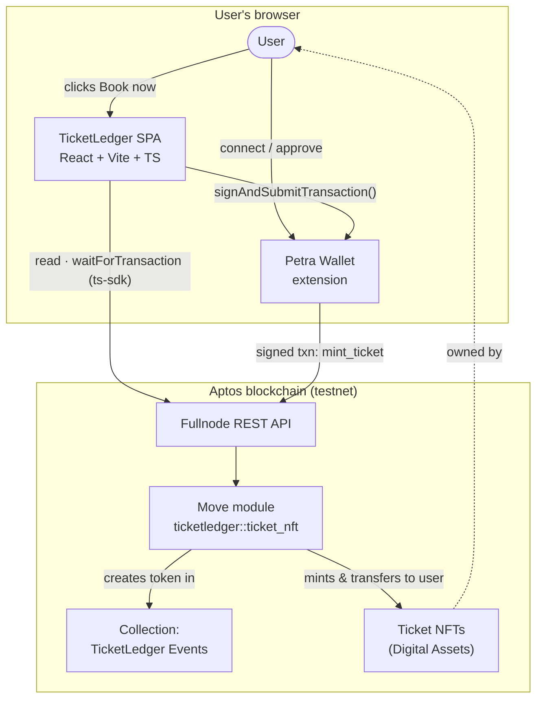

# TicketLedger

> Decentralized event ticketing on the [Aptos](https://aptos.dev) blockchain.
> Event tickets are minted as transferable **Digital Asset NFTs**; a React
> single-page app lets any wallet self-mint a ticket.

TicketLedger has two parts:

| Package      | Path         | Stack                              |
| ------------ | ------------ | ---------------------------------- |
| Move package | `contracts/` | Aptos Move, Digital Asset standard |
| Web client   | `web/`       | Vite · React 18 · TypeScript       |

There is no backend or database — state lives on-chain, and "auth" is a wallet
connection (Petra).

## Architecture



See [`ARCHITECTURE.md`](./ARCHITECTURE.md) for the design patterns behind this
layout.

## Prerequisites

- **Node.js** ≥ 22 and npm
- **[Aptos CLI](https://aptos.dev/tools/aptos-cli/)** (only to build/test/deploy
  the Move package)
- A **[Petra wallet](https://petra.app/)** browser extension (to use the app)

## Quick start (web client)

```bash
cd web
npm install
cp .env.example .env.local   # values are public testnet identifiers, not secrets
npm run dev                  # http://localhost:3000
```

### Environment variables (`web/.env.local`)

| Variable                    | Description                                   | Default      |
| --------------------------- | --------------------------------------------- | ------------ |
| `VITE_APTOS_MODULE_ADDRESS` | Address the Move package is published under   | _(testnet)_  |
| `VITE_APTOS_MODULE_NAME`    | Move module name                              | `ticket_nft` |
| `VITE_APTOS_NETWORK`        | `mainnet` \| `testnet` \| `devnet` \| `local` | `testnet`    |

Config is validated at runtime (`web/src/config/env.ts`) and fails fast with a
clear message if a variable is missing.

### Web scripts

| Script                  | Purpose                                 |
| ----------------------- | --------------------------------------- |
| `npm run dev`           | Start the dev server (port 3000)        |
| `npm run build`         | Typecheck (`tsc -b`) + production build |
| `npm run preview`       | Preview the production build            |
| `npm run typecheck`     | TypeScript only                         |
| `npm run lint`          | ESLint (type-aware + jsx-a11y)          |
| `npm run format`        | Prettier write                          |
| `npm run test` / `:run` | Vitest (watch / once)                   |
| `npm run coverage`      | Vitest coverage report                  |

## Smart contract (`contracts/`)

```bash
cd contracts
aptos move test                       # run the Move unit tests
aptos move compile                    # compile only
# publish (override the address with your own account):
aptos move publish --named-addresses ticketledger=<your-address>
```

The module `ticketledger::ticket_nft` exposes:

- `mint_ticket(buyer, name, description, uri)` — entry; mints a ticket NFT into
  the shared collection and transfers it to `buyer`.
- `is_initialized()`, `collection_name()`, `creator_object_address()` — `#[view]`s.

`init_module` creates the `TicketLedger Events` collection automatically on
publish. After deploying, set `VITE_APTOS_MODULE_ADDRESS` to the publisher
address.

## Testing & CI

- **Web:** 10 Vitest tests (config, catalogue, component, theme).
- **Contract:** 4 Move unit tests (`aptos move test`).
- **CI:** [`.github/workflows/ci.yml`](./.github/workflows/ci.yml) runs
  lint · typecheck · test · build for the web app and compile · test for the
  Move package on every push/PR.

## Project documentation

| Document                                                                           | Contents                                |
| ---------------------------------------------------------------------------------- | --------------------------------------- |
| [`ARCHITECTURE.md`](./ARCHITECTURE.md)                                             | Design patterns & module boundaries     |
| [`CHANGELOG.md`](./CHANGELOG.md)                                                   | Versioned change history                |
| [`CONTRIBUTING.md`](./CONTRIBUTING.md)                                             | Dev workflow & commit conventions       |
| [`CODE_OF_CONDUCT.md`](./CODE_OF_CONDUCT.md)                                       | Community standards                     |
| [`docs/ACCESSIBILITY_AND_PERFORMANCE.md`](./docs/ACCESSIBILITY_AND_PERFORMANCE.md) | A11y & performance audit (before/after) |
| [`docs/DISASTER_RECOVERY.md`](./docs/DISASTER_RECOVERY.md)                         | Rollback & recovery plan                |
| [`docs/LICENSE_AUDIT.md`](./docs/LICENSE_AUDIT.md)                                 | Dependency license review               |

## License

[MIT](./LICENSE) © TicketLedger contributors.
